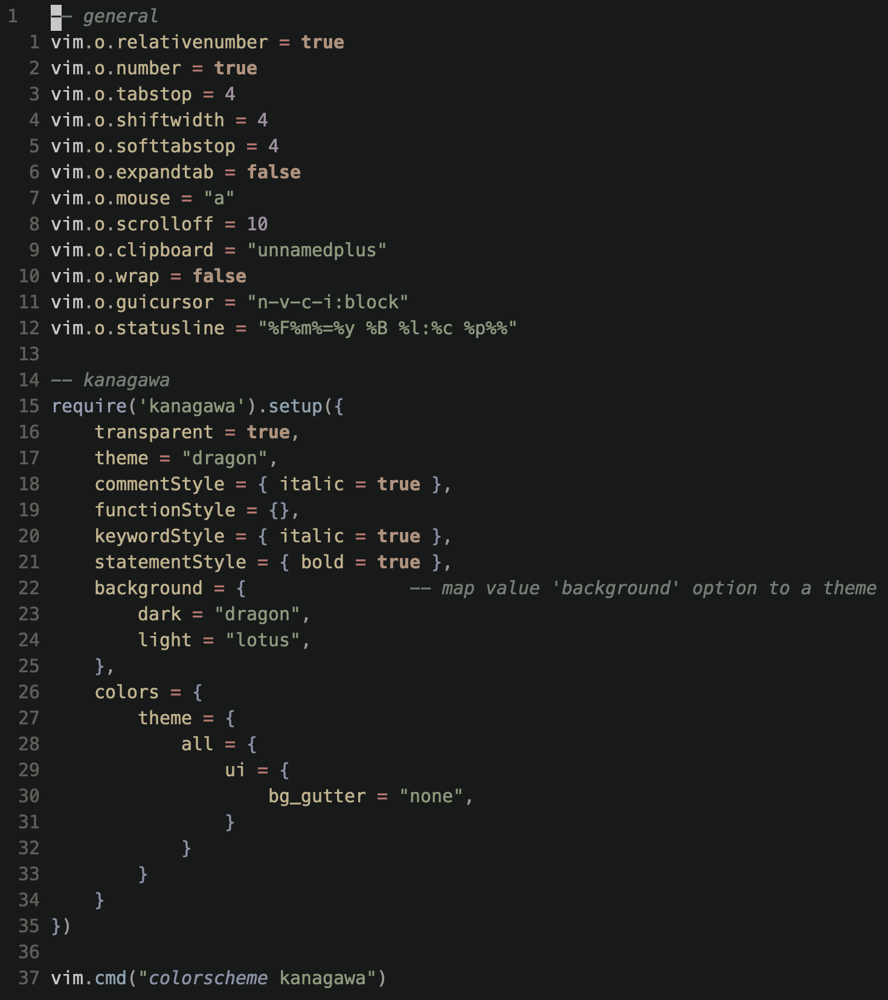

# Kerazine
- edit of Bitstream Vera Sans Mono
- only regular and oblique for now

# changelog
- implemented purely on top of Bitstream Vera Sans Mono
- shift 'i' sidebearings right for optical centering
- enlarged, vertically-centered `*`
- increase gap between `=` bars
- operator horizontal line thickness thickened and standardized
- small centering tweaks for `+`
- vertically center `~`
- raise `_` to just-below baseline, optically center for oblique
- standardize tiny inconsistencies and misalignments in `.`, `,`, `:`, and `;`
- slashed `0`
- slightly lower `l` ascender to match other ascenders
- extend slash/backslash to match parens/brackets/braces
- vertically align and fit bar/pipe to braces
- realign obliques using script against the x-height center of upright
- widen quotes, enlarge period, ellipsis, comma, semicolon, consolidate non-ascii punctuation into ascii variants, widen underscore, widen hyphen, en-dash and em-dash now just use hyphen component
