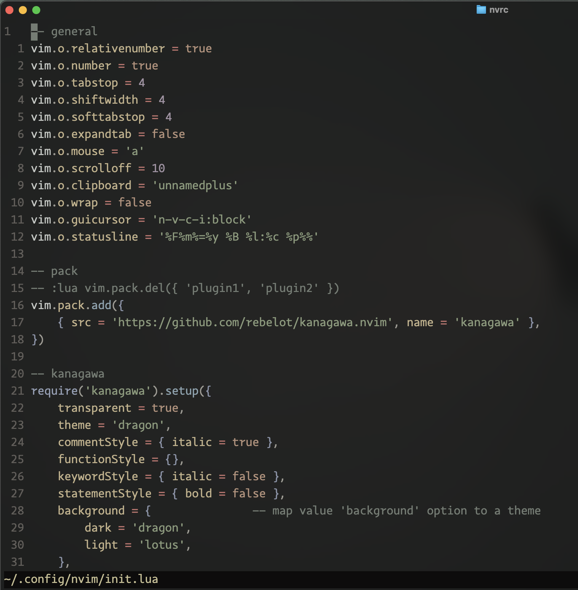

# Kerazine
A modern humanist, sans-serif monospace font.

# Done
- Basic ASCII charset.

# Todo
- Fractions
- Western European Latin charset.
- Semi-true italic (certain glyphs vary in style from roman)
- (Semi)bold weight
- Box-drawing characters
